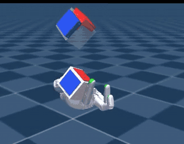
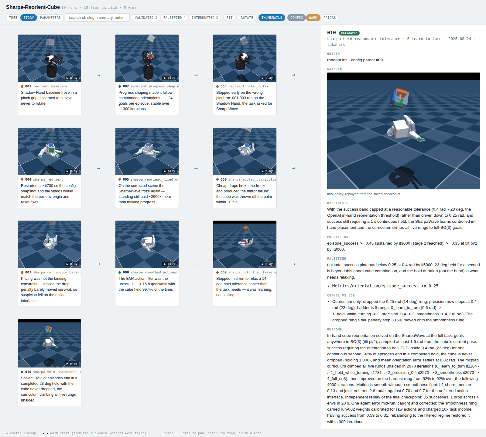

# rl-mcp

**Watch, diagnose and steer a live RL training run — from an AI agent, or from
your shell.**

Training a policy is a slow feedback loop. Launch, wait an hour, squint at
TensorBoard, guess which reward weight was wrong, relaunch. rlmcp shortens it.

Attach it to a running job and you can ask the live process what the robot is
doing, look at it, measure how jerky it is, change a reward weight, unlock harder
terrain, and roll back if that made things worse. No restart.

Built for [mjlab](https://github.com/mujocolab/mjlab) today. The simulator sits
behind a small adapter, so other backends can plug in.

> ⚠️ Experimental. The surface is real and tested, but it is still moving.

---

## 🚀 Start here

**If you use a coding agent**, give it one line:

```text
Wrap my mjlab env with rlmcp (github.com/mktk1117/rl-mcp) and show me how to use it.
```

It reads the docs here, adds the wrapper to your training script, and drives the
run from there.

**If you are driving yourself**, jump to [Install](#install) and
[Try it](#try-it).

---

## What it looks like

```bash
rlmcp status                                   # iteration, stage, headline metrics
rlmcp diagnose --seconds 4                     # is the gait smooth? is it tracking?
rlmcp shot --where terrain=pyramid_stairs      # look at a robot on the stairs
rlmcp video --seconds 5
rlmcp set reward.action_rate_l2.weight -0.25 --why "ankles chattering at 15 Hz"
rlmcp run set_terrain terrains='["flat","random_rough"]' max_level=4
rlmcp curriculum advance --why "flat is solved"
rlmcp checkpoint before-experiment             # and `rlmcp load` to undo
rlmcp play                                     # watch a finished run's policy
```

Every one of those is also an MCP tool. An agent can do all of it, and
**it sees the screenshots and plots**, not just their file paths.

The CLI knows who is reading. A terminal gets aligned tables, and pictures open
by themselves. A pipe gets JSON, and each command's JSON is a parsing contract
that does not move — the shapes are written down and pinned by tests, in
[docs/tools.md](docs/tools.md#what-a-pipe-gets).

## The whole integration

One call, between building the environment and building the runner.

```python
from mjlab.envs import ManagerBasedRlEnv
import rlmcp

env = ManagerBasedRlEnv(cfg=env_cfg, device="cuda:0", render_mode="rgb_array")
env = rlmcp.wrap(env, session_dir=log_dir / "rlmcp", curriculum="terrain")

vec_env = RslRlVecEnvWrapper(env)
runner  = VelocityOnPolicyRunner(vec_env, agent_cfg, str(log_dir), device)
env.attach_runner(runner)          # PPO knobs, checkpoints, iteration boundaries

runner.learn(num_learning_iterations=agent_cfg.max_iterations)
```

That is it. Details and traps: [docs/your-task.md](docs/your-task.md).

## What you get

| | |
| --- | --- |
| **Look at the robot** | Screenshots and clips of real training steps, not a separate eval. Pick which robot with `--where terrain=stairs`. |
| **Know why it moves badly** | `diagnose` measures jerk, chatter, effort, posture and gait, then says which lever to pull. When it cannot measure properly, it says so instead of guessing. |
| **Tune anything, live** | 97 knobs on the G1 rough task, discovered from the environment. Reward weights, randomization ranges, PPO hyperparameters. Applied between rollout batches, never mid-step. |
| **A ladder that drives itself** | Curriculum stages promote on earned conditions, not a schedule. Override any of it from a shell. |
| **Undo** | Checkpoints save weights *and* parameters, stage and extension state. |
| **Your task's own words** | Extensions add verbs, metrics and env selectors. They reach the CLI, MCP and curriculum stages at once, without editing rlmcp. |
| **A record that survives** | Every change is logged with its reason. Runs are kept as a graph with hypotheses and verdicts, so three failures in a row become one conclusion. |
| **Look at a finished run** | `rlmcp play` restores the conditions a checkpoint trained under before rendering it. Otherwise a good policy looks broken. |

## A worked example: in-hand cube reorientation

A SharpaWave hand turning a cube to a commanded orientation anywhere in SO(3),
then holding it there for a full second. This is the final policy, replayed from
its checkpoint with `rlmcp play`:

<p align="center">
  
</p>

Ten runs to get there. Three worked, four were falsified, three were stopped
early. That is the normal shape of RL work, which is why rlmcp keeps runs as a
record instead of a folder of logs. `rlmcp record graph` writes one
self-contained HTML page — no server, no build step — and it looks like this:

<p align="center">
  
</p>

Each card is one run: the clip it produced, and the one line it concluded. Click
any of them and the panel on the right shows what that run predicted, what would
have proved it wrong, what changed since its parent, and what it measured.

Runs 005 to 007 are the interesting part. The policy froze, because standing
still paid about 2600x more than making progress. Cheap drops broke the freeze
and produced the mirror failure: the cube thrown off the palm within half a
second. Re-pricing the trade in between failed too. Three failures, one
conclusion: the reward was never the binding constraint. 008 changed the action
interface instead — an EMA filter — and went from 1.1 to 16.8 goals per minute
with the cube held 99.4% of the time.

That conclusion is not in any single run. It is in the shape of three siblings,
which is the argument for keeping runs as a graph.

The same page has a **tree** view for the lineage itself and a **parameters**
view for what changed across runs. More in [docs/records.md](docs/records.md).

## Install

```bash
pip install -e .                # training side: numpy, matplotlib, pillow, imageio
pip install -e '.[server]'      # adds the MCP SDK for the agent side
```

The MCP SDK is optional on purpose. The training process does not need it, and
the server does not need a simulator. Both `mcp>=2` and `mcp` 1.x work.

Register the server with Claude Code:

```bash
claude mcp add rlmcp -- rlmcp-server --root /path/to/logs
```

## Try it

```bash
# train, with the terrain ladder driving itself
rlmcp-train Mjlab-Velocity-Rough-Unitree-G1 --num-envs 4096
```

Then, from another shell:

```bash
rlmcp sessions      # what is running
rlmcp status
rlmcp curriculum
rlmcp diagnose --seconds 4
```

The explicit-curriculum version of the same run is in
[examples/train_g1_rough_curriculum.py](examples/train_g1_rough_curriculum.py).

## Documentation

| page | for |
| --- | --- |
| [docs/tools.md](docs/tools.md) | **Every tool, one entry each.** Shell command, MCP call, what comes back, and the traps. Start here for either audience. |
| [docs/mcp-server.md](docs/mcp-server.md) | Agents: setup, session pinning, liveness, deferred jobs, a worked steering session. |
| [docs/tuning.md](docs/tuning.md) | The tuning loop: verify the task first, watch the right numbers, read symptoms into levers. The distilled findings of two campaigns. |
| [docs/your-task.md](docs/your-task.md) | Putting rlmcp on your own task, in five steps. |
| [docs/curriculum.md](docs/curriculum.md) | Writing the stage ladder. |
| [docs/extensions.md](docs/extensions.md) | Teaching rlmcp your task's vocabulary. |
| [docs/records.md](docs/records.md) | Hypotheses, verdicts, feedback, the lineage graph. |
| [docs/design.md](docs/design.md) | How it fits together, how parameters are found, other simulators. |
| [AGENTS.md](AGENTS.md) | Contributing to this repository. |

## How it works, briefly

Two processes that never touch each other. They talk through a plain directory
of JSON files.

```
   training process                session directory                 agent process
    torch + mujoco                  plain JSON files                  no simulator
┌───────────────────┐             ┌─────────────────┐             ┌──────────────────┐
│ rlmcp-wrapped env │             │ status.json     │             │ MCP server       │
│ publishes metrics │ ──writes──► │ metrics.jsonl   │ ───reads──► │ (35 tools)       │
│ records frames    │             │ events.jsonl    │             │ rlmcp CLI        │
│ runs commands     │ ◄──reads─── │ artifacts/      │ ◄──writes── │ your own scripts │
│ between batches   │             │ inbox/  outbox/ │             │                  │
└───────────────────┘             └─────────────────┘             └──────────────────┘
```

Telemetry flows left to right. Commands flow right to left. Nobody shares
memory, and nothing blocks the training loop.

That buys four things:

- The agent side never imports torch or mujoco, so starting or killing it cannot
  disturb training.
- Commands run **between rollout batches**, so an edit can never race the
  simulator.
- Everything is inspectable with `cat` when something goes wrong.
- A run leaves a complete, replayable record behind after it exits.

More in [docs/design.md](docs/design.md).

## Tests

```bash
pytest tests -q     # 766 tests, ~6s, no GPU and no simulator required
```

## License

Apache-2.0 — see [LICENSE](LICENSE).
