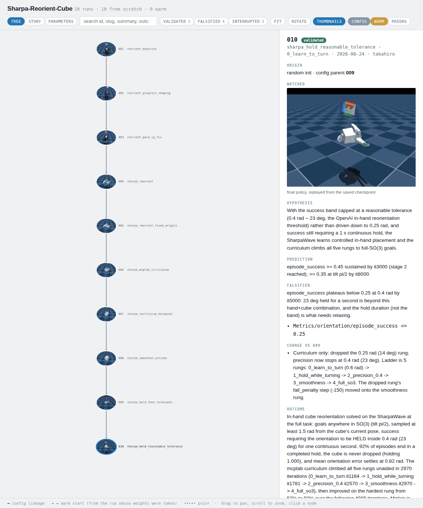

# Records: the runs, and what they showed

One session is one run. A **record** is what you keep across runs: the
hypothesis, the config snapshot, the ancestry, the verdict, and what the humans
said along the way.

Records do not live in the rl-mcp repository. They belong beside your own task
packages. `$RLMCP_RECORDS` points every `rlmcp record` command at them:

```bash
export RLMCP_RECORDS=$PWD/records
```

Resolution order: `--records-root` (or `rlmcp.wrap(records_root=)`), then
`$RLMCP_RECORDS`, then `./records`. Leave it unset and you get a scratch
`records/` wherever you happen to be standing.

## The loop

Open a record **before** launching, while the prediction still costs something
to write down.

```bash
rlmcp record new "fade the assist on hand tracking not catches" \
    --hypothesis "catch rate is the helper's achievement while assist is on" \
    --prediction "assist reaches 0 by iteration 1500, tracking error under 0.10 m" \
    --falsifier "assist is still above 0.5 at iteration 2000" \
    --falsify-when rlmcp/assist '>=' 0.5 --check-after 2000 \
    --parent 014
```

The positional argument is a slug. It names the record's directory, so keep it
short.

Then pass the id to the launcher, so the config snapshot, events and metrics
land on the record:

```bash
python mytask/train_curriculum.py --num-envs 2048 --record-run 015
```

Then close it, with evidence:

```bash
rlmcp record close 015 validated \
    --outcome "assist faded to 0 by iteration 1400; catch rate held at 62/min" \
    --metric "rlmcp/assist=0.0" "rlmcp/catch_rate_per_min=62.1"
rlmcp record asset 015 run.mp4 --kind videos --caption "final policy"
rlmcp record graph
```

Two rules the store enforces:

- A `validated` verdict with no measurement is **refused**.
- A warm-started run cannot claim `validated` at all. Its result is not
  attributable to its own change.

Verdicts: `validated`, `falsified`, `provisional`, `control`, `superseded`,
`best`, `interrupted`. `planned` and `running` mean the run has no result yet.

Attach the clip. A video that stays in `logs/` is not a deliverable. `record asset`
copies it into the records' own media store, so the record still has it after
the training logs are cleaned, and the records page has something to show.

**Progress clips arrive on their own.** A supervised run attaches a clip of
itself at iteration 0 and at doubling gaps after that -- 50, 100, 200, 400 --
each captioned `iteration 400`, so `assets.videos` already holds the run's
trajectory by the time you close it — see [progress clips](tools.md#progress-clips-the-ones-you-do-not-have-to-ask-for).
`record asset` is still how a *chosen* clip lands: the end-of-run `rlmcp play`
render, or the one frame of the run worth showing somebody.

A reader wanting the series rather than the attachments asks
`rlmcp.records.clips_of(record)`, which returns one entry per clip ordered by
iteration (with `rlmcp.records.poster.record_posters` for the stills). The
iteration lives in the caption, and that module is the only thing that writes
or reads that format.

## Falsifiers

A falsifier is the condition that would prove the run wrong, written down before
you know the answer.

`--falsifier` is the sentence. `--falsify-when METRIC OP VALUE` is the
machine-checked twin: training prints the moment it fires, and close-out records
it as `FIRED`, `held`, or `not evaluable yet` if the run died first.

`--check-after` is not optional in spirit. Every policy is bad at iteration zero,
and a falsifier with no floor fires during warm-up.

## Feedback: the steering, kept

Most of what a human contributes to a run is said, not measured. "The motion
looks jittery near the end." "Stop tuning the entropy coefficient." "Never let
the torque limit past 80% again." Said in a chat window, it is gone when the
window closes. Recorded against the run, it is not.

```bash
rlmcp feedback "it looks jittery near the end" --kind observe    # to the live trainer
rlmcp record feedback 012 "stop tuning the entropy coefficient" --kind correct
rlmcp record answer 012 0 "checked it; already at the default" --no-change
rlmcp record timeline --markdown
rlmcp record timeline --outstanding          # what nobody has answered yet
```

Feedback is append-only and each entry has a slot for what was done about it.
Six kinds: `steer`, `correct`, `reject`, `approve`, `observe`, `constrain`. The
first four ask for something, so an entry of that kind with no response is
**unanswered**, and says so in the timeline, in `REPORT.md`, and in
`rlmcp record check`.

`--no-change` is a real answer. "Looked into it, nothing needed changing" is not
the same as ignoring it, and the ledger keeps the two apart.

`rlmcp record timeline --markdown` renders the whole ledger: a table of every
remark with what it was read as and what changed, then the same in full. It is
generated from the records every time, so it cannot drift from them.

**MCP tools:** `attach_feedback`, `answer_feedback`, `get_feedback_timeline`,
`set_record_headline`. `record_feedback` is the live-run one.

## The record graph

A list of runs tells you what you did. It does not tell you what you learned,
because what you learned lives in the *differences* between runs. So records are
kept as a graph.

```bash
rlmcp record graph                         # writes records/records.html, opens it
rlmcp record graph --png --out tree.png    # a picture an agent reads in one call
```

The HTML is one self-contained file. No server, no build step. Click a node and
you get what that run claimed, what it measured, and the **recipe**: every config
change folded from the root down to that node. The recipe is never stored, only
computed, so it cannot drift from the edges.

Two kinds of edge, because they are two different claims:

| edge | means |
| --- | --- |
| **config** (`--parent`) | this run's settings are the parent's, plus a listed change |
| **warm start** (`--weights`) | this run started from that run's policy weights |

They are drawn separately because they often disagree. A run can take its config
from the run before it and its weights from six runs back, and a tool that
derives one edge from the other will draw it wrong.

### What the graph is for

Here is a real one: ten runs of in-hand cube reorientation on a SharpaWave hand.



```
001 reorient_baseline .............. falsified   froze in a pinch grip; learned to survive, not to rotate
 └─ 002 progress_shaping ........... validated   it follows commanded orientations now
     └─ 003 palm_up_fix ............ interrupted stopped: wrong platform, the task asked for SharpaWave
         └─ 004 sharpa_reorient .... interrupted restarted so the snapshot matched the fixed scene
             └─ 005 fixed_origins .. falsified   froze again: standing still paid ~2600x more than progress
                 └─ 006 curriculum . falsified   freeze broken, mirror failure: cube thrown off in ~0.5 s
                     └─ 007 balanced falsified   3x the drop penalty barely moved survival
                         └─ 008 smoothed_actions ... validated   ← the unlock: 1.1 -> 16.8 goals/min
                             └─ 009 hold_then_terminate ... interrupted  stopped to relax a 14 deg gate
                                 └─ 010 reasonable_tolerance ... validated   solved
```

**What this means:** seven of these ten runs did not produce a result, and the
graph is what made that affordable.

Runs 005, 006 and 007 are the interesting part. Each was falsified, and together
they are worth more than any one success. The first found a degenerate optimum:
standing still paid about 2600x more than making progress. The second broke it
with cheap drops and overshot the other way, throwing the cube off the palm
within half a second. The third priced the trade in between and also failed.

Three failures, one conclusion the graph makes unavoidable: the reward was never
the binding constraint. 007 had pre-registered exactly that alternative in its
falsifier. 008 changed the action interface instead — an EMA filter on the
actions — and the task opened up: 1.1 to 16.8 goals per minute, with the cube
held 99.4% of the time.

That conclusion is not visible in any single record. It lives in the shape of
three siblings, which is the argument for a graph instead of a list.

`interrupted` is a separate verdict on purpose. 003 and 004 stopped for a setup
mistake (the wrong hand), and 009 stopped for a deliberate change of plan. None
of them is a hypothesis that lost, and counting them as failures would be a lie
about what happened. `falsified` is a good verdict too: a run that kills its
hypothesis in twenty minutes is information-dense.

## Three views of the same file

The page has three tabs, and the file holds all of them:

- **tree** — the ancestry, as above. Click a node for that run's full record.
- **story** — one card per run with its clip and its one-line conclusion, in
  order. This is the view to read when you want the argument rather than the
  structure.
- **parameters** — what each config value did across the runs, so you can see
  which knob actually moved and when.

## Comparing runs

```bash
rlmcp record compare 011 012 015 --metrics Train/mean_reward rlmcp/assist \
    --at-iteration 2000
```

`--at-iteration` truncates every run to the same point. "Better at the end" often
just means "trained longer".

## Housekeeping

```bash
rlmcp record list --verdict falsified --text assist
rlmcp record show 015
rlmcp record headline 015 "assist fades on its own once catches are priced"
rlmcp record check                 # validate every record
rlmcp record reindex               # rebuild the index from the files
rlmcp record import ../old-records --dry-run
rlmcp record claim 015 --slot gpu0 --ttl 900     # lease the GPU
rlmcp record release 015
```

Records are plain files. The store assigns ids transactionally, never reuses
them, and two writers cannot silently overwrite each other.
